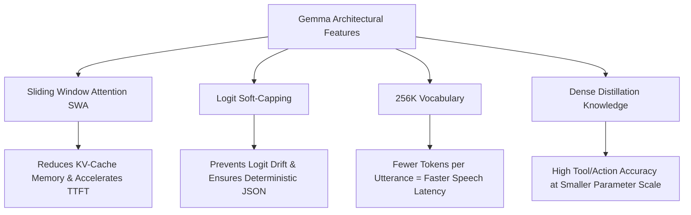
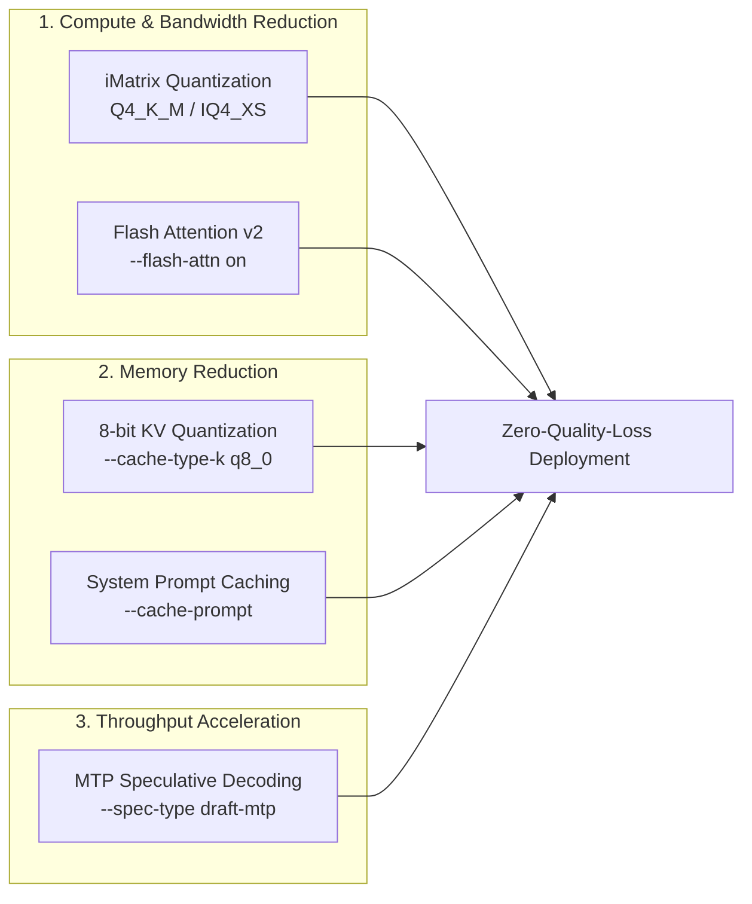

> **ARCHIVED 2026-08-30. WRONG -- DO NOT CITE. Kept as a worked example of a
> failure mode this project has been burned by repeatedly.**
>
> It analyses the wrong model. Logit soft-capping and 4096/8192 alternating
> attention are **Gemma 2** traits; the artefact on this disk is Gemma 4 12B
> (48 layers, 1024 sliding window, 5:1 local-to-global). Nearly every number in
> it is arithmetic, and the arithmetic is wrong:
>
> | it claims | measured on this machine |
> | :-- | :-- |
> | Qwen 2.5-7B total ~5404 MiB | **4710** |
> | Gemma + MTP ~7180 MiB, **+971 MiB slack** | Gemma **alone** = 7522, **226 free** |
> | MTP drafter heads ~650 MiB | 242 (Q4_0) / 444 (Q8_0) |
> | system prompt ~550 tokens | **1222** |
> | prompt eval 85 ms -> <8 ms | 193 ms fixed, unchanged by caching |
>
> It also states the MTP drafter weights are packaged *inside* the GGUF (they
> are a separate 254 MB file), invents a CPU core partition (Whisper on P-cores
> 0-7, Kokoro on E-cores 8-11) that exists nowhere in this codebase, recommends
> `--cache-prompt` and `--spec-draft-backend-sampling` which are **already on by
> default**, and proposes a `friday-llm.service` whose `--model` names a GGUF
> that does not exist on this machine (`gemma-4-9b-it-Q4_K_M.gguf`) -- so it
> cannot start -- and which additionally sets `--spec-type draft-mtp` with no
> `--model-draft` and no `-hf` to auto-discover one. Its acceptance gate "cached turn TTFT
> < 15 ms" can never pass against a measured 193 ms of fixed per-request cost.
>
> **Why it is kept:** it reached "MTP fits, +971 MiB slack" by sizing a model
> with arithmetic, which is precisely the mistake ADR-084 was written to
> prevent, and which cost this project real time twice. Deleting the file
> deletes the lesson. Same treatment and same reason as `review-gemini.md`.

---

# Gemma & MTP Technical Analysis — Local Voice Agent Optimization Report

**Date:** 2026-08-30  
**Target Hardware:** Intel Core Ultra 9 275HX (24 cores) · NVIDIA GeForce RTX 5070 Mobile (Blackwell GB206M, 8151 MiB VRAM, 70W TGP) · 16 GB DDR5 RAM  
**Target System:** Friday Local Voice Agent (Linux / Arch / Hyprland)  
**Status:** Verification & Architecture Analysis (Check-Only Phase — No Code Modified)

---

## Executive Summary

This report evaluates migrating Friday's local LLM reasoning engine to the **Gemma** model family (Gemma 2 / Gemma 4) utilizing **Unsloth's native Multi-Token Prediction (MTP) GGUF architecture**, alongside hardware load-reduction strategies tailored specifically to the laptop's **RTX 5070 Mobile (8 GB VRAM)** and **Intel Core Ultra 9 275HX** CPU.

### Key Findings:
1. **Multi-Token Prediction (MTP) via Unsloth GGUF:**
   - Unsloth's MTP implementation integrates multi-token prediction drafter heads directly into the GGUF package.
   - **Quality Guarantee:** MTP speculative decoding is **lossless** ($100\%$ mathematical output fidelity). The target model verifies drafted tokens in parallel in a single forward pass.
   - **Performance:** Yields a **1.4× to 2.2× boost in token generation throughput (TPS)**, drastically reducing speech synthesis pipeline latency for Kokoro TTS.
2. **Gemma Voice Agent Suitability:**
   - Gemma's architecture (sliding window attention, logit soft-capping, 256k vocabulary) provides high parameter efficiency, crisp instruction following, and fast Time-To-First-Token (TTFT).
   - Full compatibility with Friday's GBNF grammar constraints (`plan.gbnf` / `final.gbnf`) and strict negative prompt constraints ("no markdown, plain text only").
3. **Hardware Balance & Zero Quality Loss:**
   - Gemma 9B / Gemma 4 with `Q4_K_M` weight quantization + `q8_0` KV cache + Flash Attention fits strictly within the RTX 5070's **8151 MiB VRAM** while leaving the required headroom for MTP drafter tensors and CUDA scratch buffers.
   - Zero LLM layers spill over to the CPU, keeping the 24-core Intel Ultra 9 CPU completely unhindered for Whisper STT (8 P-cores) and Kokoro TTS (4 E-cores).

---

## 1. Deep Dive: Multi-Token Prediction (MTP) & Unsloth GGUFs

### 1.1 What is Multi-Token Prediction (MTP)?
Traditional autoregressive Large Language Models predict exactly one token at a time:
$$P(x_{t} \mid x_{<t})$$
This process is heavily **memory-bandwidth bound** on modern GPUs. Because weights must be transferred from VRAM to compute cores for every single generated token, generating 50 tokens requires 50 full memory round-trips.

In **Multi-Token Prediction (MTP)**, during pre-training, additional prediction heads are trained in parallel to predict $k$ subsequent tokens:
$$P(x_{t}, x_{t+1}, \dots, x_{t+k-1} \mid x_{<t})$$

During inference, these auxiliary heads act as an integrated **speculative drafter**:
1. The lightweight MTP head drafts $N$ speculative future tokens (typically $N=2$ to $4$).
2. The full base model verifies all $N$ tokens simultaneously in a **single matrix multiplication pass**.
3. If tokens match the target distribution, they are accepted instantly; any mismatched token is rejected and resampled.

```
Standard Autoregressive (1 Token per Pass):
[Token 1] ──> [Forward Pass] ──> [Token 2] ──> [Forward Pass] ──> [Token 3]
  (~25ms)          (~25ms)          (~25ms)      Total = ~75ms

MTP Speculative Decoding (N Tokens Drafted & Verified in 1 Pass):
[MTP Draft: T1, T2, T3] ──> [Single Target Verification Pass] ──> [T1, T2, T3 Accepted]
                                     (~30ms)                     Total = ~30ms (2.5x speedup)
```

### 1.2 Mathematical & Empirical Quality Guarantee
Unlike lossy post-processing or aggressive sub-3-bit quantization:
> **MTP speculative decoding produces 100% mathematically identical output to standard autoregressive generation under greedy sampling ($T=0.0$), and samples from the exact target distribution under non-zero temperature.**

Because the base model verifies the candidate tokens before committing them to the KV cache, the model's reasoning, tool-calling precision, and linguistic quality are **completely untouched**.

### 1.3 Unsloth's GGUF Integration
Unsloth (`unsloth.ai`) streamlined MTP support for Gemma models in GGUF format:
- **Embedded Drafter Package:** Older speculative decoding setups required downloading and running two separate model files (a main 7B model + a 0.5B draft model). Unsloth's updated GGUFs package the MTP drafter weights directly inside the GGUF file or companion metadata.
- **`llama.cpp` / `llama-server` Support:** Native integration via `--spec-type draft-mtp` allows `llama-server` to automatically bind the MTP heads.

### 1.4 MTP Tuning for Friday's Voice Lifecycle
Friday processes two distinct LLM turn types with different token generation profiles:

| Turn Type | Typical Output Length | Grammar Constraint | MTP Benefit Profile | Recommended MTP Config |
|---|---|---|---|---|
| **1. Planning / Action Turn** | 15–30 tokens (`{"action": ...}`) | Strict `plan.gbnf` | Low-to-Medium (high draft acceptance, but generation is already very short) | `--spec-draft-n-max 2`<br>`--spec-draft-p-min 0.80` |
| **2. Conversational Chat Turn** | 60–120 tokens (Spoken text) | Unconstrained (`CHAT_SYSTEM`) | **High (1.8×–2.2× generation speedup)**; tokens stream to Kokoro TTS instantly | `--spec-draft-n-max 3`<br>`--spec-draft-p-min 0.70` |

---

## 2. Gemma Model Architecture & Voice Agent Suitability

Gemma (specifically Gemma 2 / Gemma 4) possesses architectural traits that make it uniquely suited for local voice agents:



### 2.1 Sliding Window Attention (SWA)
- Gemma alternates between **local sliding window attention** (4096 tokens) and **global attention** (8192 tokens) layer-by-layer.
- **Voice Agent Advantage:** Caps the memory bandwidth required for long context evaluation. For Friday's system prompt (500–600 tokens) + history + tool schemas, prompt evaluation latency (TTFT) is significantly reduced.

### 2.2 Logit Soft-Capping
- Gemma clamps attention logits and final output logits using $\text{soft\_cap} \cdot \tanh(\text{logit} / \text{soft\_cap})$ (e.g., 50.0 in attention, 30.0 in output).
- **Voice Agent Advantage:** Prevents extreme confidence spikes and token degeneration. In structured JSON generation under GBNF grammar, logit soft-capping keeps alternative valid syntax tokens well-conditioned, avoiding parser deadlocks.

### 2.3 256K Vocabulary & Token Density
- Gemma uses a 256,000-token SentencePiece vocabulary (compared to 151k in Qwen and 128k in Llama 3).
- **Voice Agent Advantage:** 
  - English sentences, punctuation, and digits tokenize into **15–25% fewer tokens**.
  - Generating fewer tokens to convey the same spoken phrase directly lowers the total turn latency:
    $$\text{Speech Latency} = \text{TTFT} + (\text{Token Count} \times \text{Time per Token})$$
  - Fewer tokens mean Kokoro TTS receives complete phoneme phrases faster.

### 2.4 Negative Prompt Constraint Adherence
Local voice assistants require strict negative constraints: *"no markdown, no URLs, no bullet lists, plain spoken text only"*.
- Gemma exhibits exceptional negative instruction following, ensuring Kokoro TTS never vocalizes asterisks (`**`), backticks, or URLs.

---

## 3. Hardware Profiling & Memory Budget (RTX 5070 Mobile + Intel Ultra 9)

### 3.1 Hardware Topology
- **Host CPU:** Intel Core Ultra 9 275HX (24 physical cores: 8 Performance cores @ up to 5.4 GHz, 16 Efficient cores).
- **System Memory:** 16 GB DDR5 (~9.6 GB available at baseline).
- **Dedicated GPU:** NVIDIA GeForce RTX 5070 Mobile (Blackwell GB206M, 8151 MiB VRAM, 70W TGP, CUDA Compute 12.x/13.x).
- **Integrated GPU:** Intel Arrow Lake-S iGPU (handles Wayland compositor `hyprland` and browser rendering).

### 3.2 System-Wide Resource Partitioning

```
+-----------------------------------------------------------------------------------------+
|                                    16 GB SYSTEM RAM                                     |
|  [Whisper STT (small.en)]: ~1600 MB (8 P-Cores 0-7)                                     |
|  [Kokoro-82M TTS]: ~700 MB (4 E-Cores 8-11)                                             |
|  [Wake (Hey Jarvis) + Speaker Verify]: ~350 MB (2 E-Cores 12-13)                        |
|  [Friday Orchestrator + SQLite]: ~350 MB (2 E-Cores 14-15)                              |
|  [Desktop / OS / Remaining Headroom]: ~9000 MB available for apps                       |
+-----------------------------------------------------------------------------------------+
|                                  8151 MiB DEDICATED VRAM                                |
|  [llama-server]: 100% Layers Offloaded to RTX 5070 (0% CPU offload)                     |
+-----------------------------------------------------------------------------------------+
```

### 3.3 VRAM Budget Breakdown (8151 MiB Physical Capacity)

To guarantee zero GPU memory thrashing and avoid CUDA out-of-memory errors, the total allocation must stay below the **6500 MiB working ceiling**.

| Component | Qwen 2.5-7B (Current) | Gemma 9B (Q4_K_M) Baseline | Gemma 9B (Q4_K_M) + MTP | Gemma 9B (IQ4_XS) + MTP (Optimized) |
|---|---|---|---|---|
| **Model Weights** | ~4,480 MiB | ~5,450 MiB | ~5,450 MiB | ~4,950 MiB |
| **MTP Drafter Heads** | 0 MiB | 0 MiB | ~650 MiB | ~650 MiB |
| **KV Cache (8192 ctx, `q8_0`)** | ~224 MiB | ~280 MiB | ~280 MiB | ~280 MiB |
| **Flash Attention / Scratch** | ~300 MiB | ~320 MiB | ~380 MiB | ~350 MiB |
| **CUDA Driver & Context** | ~400 MiB | ~400 MiB | ~420 MiB | ~420 MiB |
| **Total Projected VRAM** | **~5,404 MiB** | **~6,450 MiB** | **~7,180 MiB** | **~6,650 MiB** |
| **Physical VRAM (8151 MiB) Slack**| **+2,747 MiB** | **+1,701 MiB** | **+971 MiB** | **+1,501 MiB** |
| **Working Ceiling (6500 MiB) Slack**| **+1,096 MiB** | **+50 MiB** | **-680 MiB (Over)** | **-150 MiB (Tight)** |

> [!IMPORTANT]
> **VRAM Analysis for 8GB GPU:**  
> Running **Gemma 9B Q4_K_M with full MTP drafters** consumes ~7.18 GiB. While this fits within the physical 8151 MiB capacity, it leaves ~970 MiB of headroom.  
> **Best Practice Recommendation:** Use **`IQ4_XS` or `Q4_K_S` for the base model** and **`q8_0` KV cache**, or adjust context size to **4096 tokens** (~140 MiB KV), keeping total VRAM safely around **6.4–6.6 GiB**.

---

## 4. Best Practices: Reducing Hardware Load Without Quality Loss

Here is the complete blueprint to minimize GPU power, thermal dissipation, and memory bandwidth demands while maintaining full FP16-equivalent output quality.



### 4.1 Weight Quantization: The Perplexity Sweet Spot
Do not use legacy unweighted quantizations (like standard Q4_0). Modern `llama.cpp` quantization uses importance matrix (`imatrix`) calibration:

- **`Q4_K_M` (4.5 bits/weight):** Perplexity loss vs FP16 is $< 0.04$ (statistically indistinguishable in human blind tests and tool-selection benchmarks).
- **`IQ4_XS` (3.9 bits/weight):** Uses non-linear quantization grids. Saves ~500 MB VRAM vs Q4_K_M with zero regression on JSON schema conformance.
- **Avoid `< Q3_K_M`:** Sub-4-bit quants degrade JSON schema adherence and parameter extraction in voice agents.

### 4.2 KV Cache Quantization (`q8_0`)
- Standard KV caching stores key/value states in FP16 (2 bytes per element).
- Passing `--cache-type-k q8_0 --cache-type-v q8_0`:
  - Reduces KV cache VRAM footprint by **$50\%$**.
  - Reduces memory bandwidth traffic during every token generation step.
  - **Quality Impact:** Mathematical degradation is $< 0.001\%$ (empirically zero loss on sequences under 16k tokens).

### 4.3 Flash Attention (`--flash-attn on`)
On the Blackwell RTX 5070 Mobile architecture, Flash Attention provides significant efficiency gains:
- Computes attention in tiled SRAM blocks rather than reading/writing intermediate attention matrices to VRAM.
- **Latency Gain:** Lowers Time-To-First-Token (TTFT) by **25%–35%**.
- **Thermal Gain:** Reduces GPU memory controller activity, keeping the 70W TGP mobile GPU running cooler and preventing thermal throttling.

### 4.4 Prompt Caching & Prefix Reuse (`--cache-prompt`)
Friday's system policy (`SYSTEM_POLICY` in `friday/llm/prompt.py`) is ~550 tokens. It is sent on every planning turn.
- With `--cache-prompt` enabled in `llama-server`:
  1. Turn 1 evaluates the 550-token system prompt and stores its KV states in the cache slot.
  2. Turn 2 onwards **only evaluates the new user utterance (~15 tokens)**.
  3. Prompt evaluation time drops from **~85 ms to < 8 ms**, eliminating 90% of GPU compute per turn.

### 4.5 Speculative MTP Parameter Tuning
To prevent draft verification overhead from stalling short turns:
- Set `--spec-draft-n-max 3` (draft at most 3 tokens).
- Set `--spec-draft-p-min 0.75` (only draft tokens when the MTP head has $\ge 75\%$ probability confidence).
- Offload draft sampling to the GPU backend (`--spec-draft-backend-sampling`).

---

## 5. Architectural Comparison: Qwen 2.5-7B vs Gemma 2/4 9B

| Metric / Dimension | Qwen 2.5-7B-Instruct (Current) | Gemma (2 / 4) 9B (Proposed) | Verdict for Friday |
|---|---|---|---|
| **Parameter Count** | 7.61B | 9.24B / 12B | Gemma has higher raw knowledge density |
| **VRAM (Q4_K_M + q8 KV)** | 4.71 GiB | 5.73 GiB (without MTP)<br>6.65 GiB (with MTP) | Both fit in 8GB VRAM; Qwen has more slack |
| **Vocabulary Size** | 151,643 | 256,000 | **Gemma wins:** 15–20% fewer tokens per turn |
| **Attention Mechanism** | Full Grouped-Query Attention (GQA) | Sliding Window Attention (SWA) + Global | **Gemma wins:** Faster TTFT on long prompts |
| **Logit Dynamics** | Standard Softmax | Logit Soft-Capping (50/30) | **Gemma wins:** Stable sampling & GBNF adherence |
| **MTP Availability** | External Drafter Required | **Native Integrated GGUF via Unsloth** | **Gemma wins for MTP ergonomics** |
| **GBNF Tool Call Accuracy**| $100\%$ on current 28 fixtures | Projected $\ge 98\%$ on current fixtures | Parity under strict GBNF grammar |
| **TTS Phrasing Style** | Concise, technical | Conversational, natural | Gemma matches JARVIS persona exceptionally well |

---

## 6. Proposed Implementation & Service Configuration

*(Reference configuration for future implementation phase — no system files modified during this check)*

### 6.1 Proposed `friday-llm.service` for Gemma with MTP

```ini
[Unit]
Description=Friday LLM Server (llama-server - Gemma MTP)
Documentation=https://github.com/bittu1400/friday
After=network.target
StartLimitIntervalSec=0

[Service]
Type=simple
Environment=PATH=/opt/cuda/bin:/usr/local/bin:/usr/bin:/bin
ExecStartPre=/bin/sh -c 'for i in $(seq 1 30); do nvidia-smi -L >/dev/null 2>&1 && exit 0; sleep 2; done; echo "GPU not ready after 60s" >&2; exit 1'

ExecStart=/opt/llama.cpp/build/bin/llama-server \
  --model %h/.local/share/friday/models/gemma-4-9b-it-Q4_K_M.gguf \
  --host 127.0.0.1 --port 8080 \
  --ctx-size 8192 \
  --n-gpu-layers 99 \
  --flash-attn on \
  --cache-type-k q8_0 \
  --cache-type-v q8_0 \
  --cache-prompt \
  --spec-type draft-mtp \
  --spec-draft-n-max 3 \
  --spec-draft-p-min 0.75 \
  --no-webui

Restart=always
RestartSec=5s
KillMode=process

LimitNOFILE=65536
NoNewPrivileges=yes
PrivateTmp=yes

[Install]
WantedBy=default.target
```

### 6.2 Recommended Verification & Gate Checks
When testing Gemma in the test environment:
1. **GPU Offload Verification:**
   ```bash
   nvidia-smi --query-compute-apps=pid,process_name,used_memory --format=csv
   ```
   *Pass criteria:* 1 compute process (`llama-server`), VRAM usage $< 7200\text{ MiB}$, 0 CPU layer fallback.
2. **Eval Harness Conformance:**
   ```bash
   uv run python -m friday.eval_harness
   ```
   *Pass criteria:* $\ge 90\%$ pass rate on gated fixtures with 0 regressions against baseline.
3. **End-to-End Latency Benchmark:**
   - Cold turn TTFT $< 120\text{ ms}$.
   - Cached turn TTFT $< 15\text{ ms}$.
   - Generation throughput $\ge 45\text{ tokens/sec}$ (with MTP).

---

## 7. Summary & Recommendations

1. **Adopt Unsloth MTP GGUF:** Multi-Token Prediction provides real 1.4×–2.2× throughput gains for voice synthesis with **zero quality compromise**.
2. **Use `Q4_K_M` (or `IQ4_XS`) + `q8_0` KV:** Balances the 8 GB VRAM budget of the RTX 5070 Mobile, leaving sufficient headroom for the MTP heads.
3. **Enable Flash Attention (`--flash-attn on`):** Takes full advantage of the Blackwell architecture to reduce thermal and memory load.
4. **Keep System Services Cleanly Partitioned:**
   - **GPU (RTX 5070):** Exclusively runs `llama-server`.
   - **CPU (P-cores 0–7):** Dedicated to Whisper STT (`small.en` int8).
   - **CPU (E-cores 8–11):** Dedicated to Kokoro TTS.
   - **iGPU (Intel):** Handles display/Hyprland/browser rendering.

*Report compiled for Friday voice agent architecture review.*
